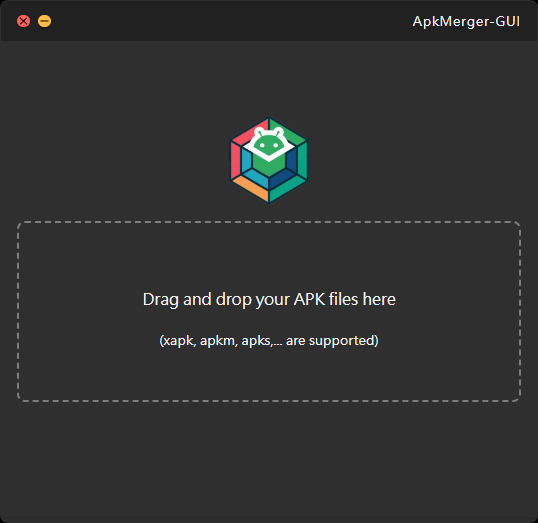

# APK Merger GUI  

This is a GUI application built with [Tauri](https://tauri.app/), based on [APK Editor](https://github.com/REAndroid/APKEditor), to merge Split-APK into a Single-APK.  

## Features  
- Intuitive GUI for easy usage  
- Lightweight and cross-platform with Tauri  
- Integrates APK Editor’s APK Merger for automated processing  
- Elegant macOS-style UI for a sleek and intuitive experience  

## Screenshots


## Installation & Usage  

### Run  
1. Open APK Merger GUI after installation  
2. Select the Split-APK files  
3. Click the "Merge" button to start the process  
4. Get the merged Single-APK  

## Requirements  
- Windows / macOS / Linux  
- Node.js & Rust (for development)  

## Development & Build  
```bash
# Install dependencies
yarn install

# Start in development mode
yarn tauri dev

# Build the application
yarn tauri build
```

## Contribution  
Feel free to open issues or submit PRs to improve this tool!  

## License  
Apache License 2.0
